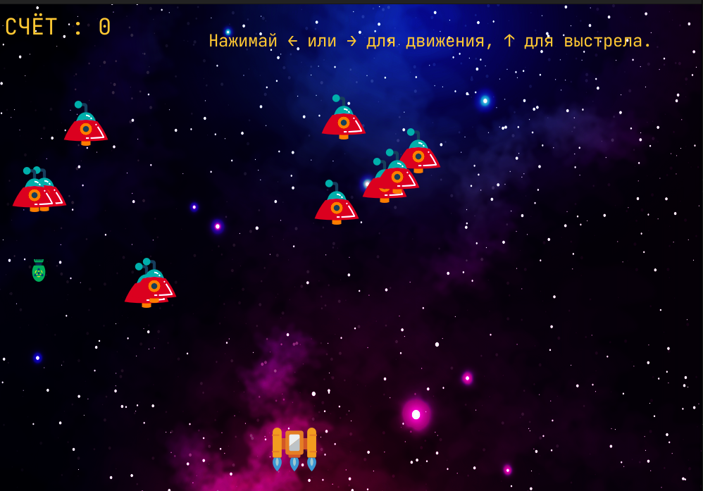

# GalaxyGame

**Описание** : простая космическая игра, написанная с использованием библиотеки pygame.

**Запуск** :

1. Установить python3 и установить pip(пакетный менеджер python)

2. Установить pygame (pip install pygame)

3. Запустить файл game.py (python3 game.py)

**Игровой процесс** :

